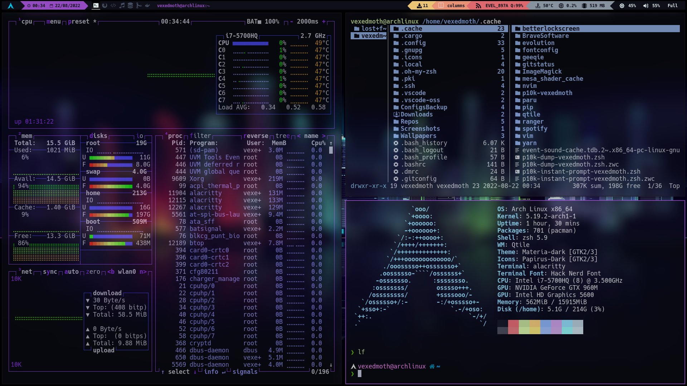
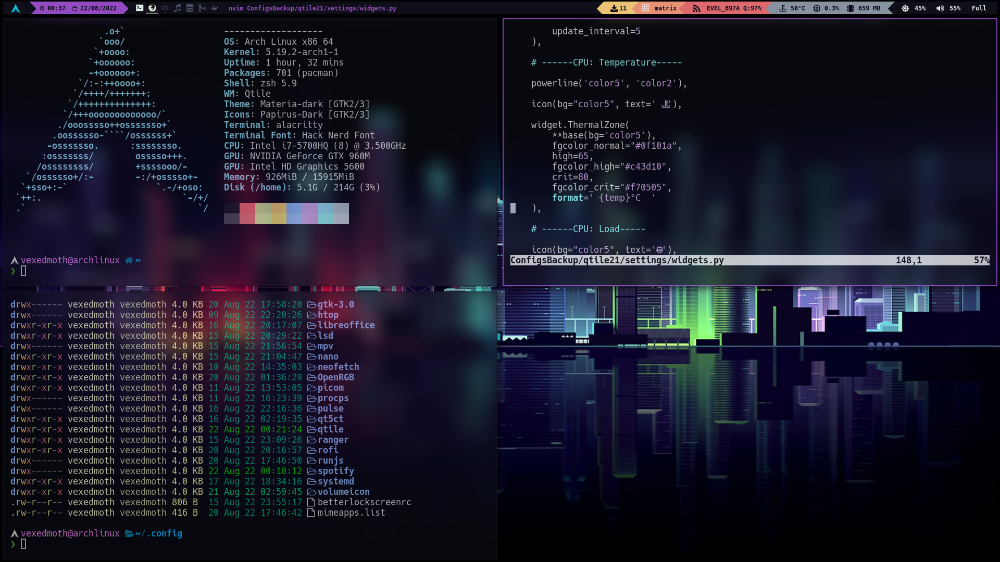

# Arch Linux setup and configuration


```

                           __                __  __  
 _   _____  _  _____  ____/ /___ ___  ____  / /_/ /_ 
| | / / _ \| |/_/ _ \/ __  / __ `__ \/ __ \/ __/ __ \ 
| |/ /  __/>  </  __/ /_/ / / / / / / /_/ / /_/ / / /
|___/\___/_/|_|\___/\__,_/_/ /_/ /_/\____/\__/_/ /_/  github.com/vexedmoth
                                                     

```






---------------------------------------------------------------

# _Basic Installation_


Follow the [installation guide](https://wiki.archlinux.org/title/installation_guide) from Arch Wiki in order to get a basic and lightweight Arch structure. 


# _Required Setup_ 


Right after a complete and basic Arch based distro installation, follow the steps below:

1. Configure [iwd](https://wiki.archlinux.org/title/iwd). It's a wireless daemon that can work with either [systemd-networkd](https://wiki.archlinux.org/title/Systemd-networkd) or [NetworkManager](https://wiki.archlinux.org/title/NetworkManager#Using_iwd_as_the_Wi-Fi_backend). In this case, I prefer running a system daemon like systemd-networkd to manage networks. To start the client program run:
```zsh
iwctl
```
Once inside the client, we need to know how our network interface is named. 
```zsh
[iwd]# device list
```
In my case, the interface is named as `wlan0`. So now, scan available near networks and list them
```zsh
[iwd]# station wlan0 scan
[iwd]# station wlan0 get-networks
```
Then, connect to the desired network and after that check if we are connected
```zsh
[iwd]# station wlan0 connect MY_NETWORK
[iwd]# station wlan0 show
```
2. Install [pipewire](https://wiki.archlinux.org/title/PipeWire) as audio server
3. Install propietary [Nvidia Drivers](https://wiki.archlinux.org/title/NVIDIA) as graphics driver
4. Install [qtile](https://wiki.archlinux.org/title/Qtile) as DE/WM
5. Install [alacritty](https://github.com/alacritty/alacritty) as the main terminal emulator
6. Install [git](https://wiki.archlinux.org/title/git) as version control system


# _Post-Installation_


## Add user to wheel group
First we need to log as root user
```zsh
su -
```

As root, we need to add vexedmoth user to the "wheel group" in order to grant sudo permissions. 

```zsh
usermod -aG wheel vexedmoth
```
Then open the `/etc/sudoers` file and uncomment the following line:

```bash
%wheel ALL=(ALL) ALL
```


## Install Paru AUR helper
Standard pacman wrapping [AUR](https://wiki.archlinux.org/title/Arch_User_Repository) helper that allows to get access to the Arch User Repository. 

```zsh
sudo pacman -S --needed base-devel
git clone https://aur.archlinux.org/paru.git
cd paru
makepkg -si
```


## GitHub ssh keys
Since we will need to clone our dotfiles from this repo and other github repositories later on, let's generate ssh keys and add them to GitHub. (I prefer this option over via https). 

[Steps](https://docs.github.com/en/authentication/connecting-to-github-with-ssh/generating-a-new-ssh-key-and-adding-it-to-the-ssh-agent)

Then we can clone this repo via SSH. 
```zsh
git clone git@github.com:vexedmoth/dotfiles.git
```

**WARNING**:
If we clone via HTTPS, later we'll not be able to push changes via SSH, we would clone via HTTPS instead.


## Enable GRUB os-prober
If we are using dual boot and the GRUB bootloader does not detect automatically other OS, then we need to install:
- [os-prober](https://archlinux.org/packages/?name=os-prober) (detect other distros using a dual boot system)
- [ntfs-3g](https://wiki.archlinux.org/title/NTFS-3G) (read NTFS files like UEFI boot file from other OS like Windows)
- [update-grub](https://aur.archlinux.org/packages/update-grub) (simple wrapper around grub-mkconfig)

Open the `/etc/default/grub` file and uncomment the following line:

```bash
GRUB_DISABLE_OS_PROBER=false
```

Besides we can take the opportunity to change the timeout by changing the line:
```bash
GRUB_TIMEOUT=60
```

After that, we need to update grub by running
```bash
sudo update-grub
```


## Enable Touchpad Tap
Check if [libinput](https://wiki.archlinux.org/title/libinput) is installed in our system. If not, install it.

List devices and check if touchpad is listed. 

```zsh
sudo libinput list-devices
```
If is not listed, create a config file named `30-touchpad.conf` in `/etc/X11/xorg.conf.d/` and add this lines:

```
Section "InputClass"
Identifier "touchpad"
Driver "libinput"
  MatchIsTouchpad "on"
  Option "Tapping" "on"
  Option "NaturalScrolling" "on"
  Option "ClickMethod" "clickfinger"
EndSection
```
Reboot the system. 


## Configure login manager
If we want to start the system through the terminal without a login manager, we need to uninstall these packages:
- [lightdm](https://wiki.archlinux.org/title/LightDM) (login manager by default after installation)
- [lightdm-gtk-greeter](https://archlinux.org/packages/?name=lightdm-gtk-greeter) (default GUI that prompts the user for credentials)

After that we need to paste the [xinit](https://wiki.archlinux.org/title/xinit) file `.xinitrc` from this repo in home directory `~/`. Xinit program allows to start a Xorg display server and will be executed only when there is no login manager running.

**WARNING**

1. Before reboot or poweroff the system, go to the last lines of the `.xinitrc` file (after # My config) and check which programs will be executed in the background (&). To avoid boot problems is recommended comment out those programs that we have not yet installed (when install them later remember to uncomment)

2. After reboot and logging in, we need to start our graphical environment (X) by running (type this after each booting is temporary until we set up zsh configuration later): 
```zsh
startx
```


## Add Scripts
Custom scripts to automate tasks.

Paste `bin` directory in `~/.local/`


## Enable suspend 
By default, the system may not suspend on lid close or powerkey press button. So we need to change config in `/etc/systemd/logind.conf` and uncomment this lines:
```bash
HandlePowerKey=suspend
HandlePowerKeyLongPress=poweroff
HandleLidSwitch=suspend
HandleLidSwitchExternalPower=suspend
HandleLidSwitchDocked=suspend
LidSwitchIgnoreInhibited=yes
```
_PD: The commented lines are the default setting_


## Enable lock screen after suspend
1. Install [betterlockscreen](https://github.com/betterlockscreen/betterlockscreen) package. 
2. Paste `betterlockscreenrc` from this repo into `~/.config/`
3. Link a lock wallpaper by doing
```zsh
betterlockscreen -u ~/Wallpapers/lockscreen.png
```

4. Create a file named `betterlockscreen@.service` into `/etc/systemd/system/` and add this lines:
```
[Unit]
Description=Lock X session using betterlockscreen for user %i
Before=sleep.target

[Service]
User=%i
Environment=DISPLAY=:0
ExecStart=/usr/bin/betterlockscreen -l
ExecStartPost=/usr/bin/sleep 2

[Install]
WantedBy=sleep.target
```
5. Enable and start that service
```zsh
sudo systemctl enable betterlockscreen@vexedmoth.service
sudo systemctl start betterlockscreen@vexedmoth.service

```
_(If enabling and starting the service does not work, reboot system)_


## Load openRGB keys after suspend
RGB keys will automatically init at the background at system boot (already set in `xinitrc` file). But after suspend the color switch to default (red). We want to avoid this and load the same color always.  
1. Install [openrgb-bin](https://aur.archlinux.org/packages/openrgb-bin) package
2. Create a file named `openRGB@.service` into `/etc/systemd/system/` and add this lines:
```
[Unit]
Description=Set openRGB color keys after suspend
After=suspend.target

[Service]
User=%i
Type=simple
ExecStart=/home/vexedmoth/.local/bin/loadopenRGB

[Install]
WantedBy=suspend.target
```
3. Add script binaries to PATH in `.bashrc` in order to run `loadopenRGB` script (this will be temporary until we set up zsh configuration later).
```zsh
if [ -d "$HOME/.local/bin" ] ;
  then PATH="$HOME/.local/bin:$PATH"
fi
```

4. Enable and start that service
```zsh
sudo systemctl enable openRGB@vexedmoth.service
sudo systemctl start openRGB@vexedmoth.service

```
_(If enabling and starting the service does not work, reboot system)_


## Enable Bluetooth service
In order to add bluetooth devices such as keyboard or headsets, we will need to install and enable a bluetooth service. In my case, we just want to add a bluetooth headset. Follow the steps below:

1. Install [bluez](https://archlinux.org/packages/extra/x86_64/bluez/) package to provide Bluetooth protocol to our system and [bluez-utils](https://archlinux.org/packages/extra/x86_64/bluez-utils/) package to provide bluetoothctl utility.
2. Make sure btusb kernel module is loaded
```zsh
lsmod | grep btusb
```
3. Check if bluetooth adapter is connected or blocked
```zsh
sudo rfkill list
```
4. Enable and start the service
```zsh
sudo systemctl enable bluetooth.service
sudo systemctl start bluetooth.service
```
5. Pair and connect devices for the first time
We need to start the client first by running
```zsh
bluetoothctl
```

Once the client is initialized, then we need to power on our bluetooth controller
```zsh
[bluetooth]# power on
```

Then, enable the agent and setting as default. This will allow to remember our paired devices every time we want to connect them.
```zsh
[bluetooth]# agent on
[bluetooth]# default-agent
```
Scan the available devices and list them. Wait a few seconds until find all devices after scanning and then list the devices.
```zsh
[bluetooth]# scan on
[bluetooth]# devices
```

Once we have located our device name, we'll copy its bluetooth MAC address (in my case, my headset address is 00:00:00:00:F3:31) and we'll run the following commands in order to finally connect
```zsh
[bluetooth]# trust 00:00:00:00:F3:31
[bluetooth]# pair 00:00:00:00:F3:31
[bluetooth]# connect 00:00:00:00:F3:31
```

6. From now on, we will be able to connect our devices automatically when switch them on, since our system is running bluetooth.service all the time. However, when we don't have any device connected, the service will keep running, and this consumes resources. To solve this, is as simple as enabling/disabling the service each time.

- Enabling service
```zsh
sudo systemctl enable bluetooth.service
sudo systemctl start bluetooth.service
```

- Disabling service
```zsh
sudo systemctl disable bluetooth.service
sudo systemctl stop bluetooth.service
```

_We can check if the service is enabled/disabled by running:_
```zsh
systemctl status bluetooth.service
```


## Change GTK theme and icons
By default, the [GTK](https://wiki.archlinux.org/title/GTK) theme and icons is Adwaita. Let's change it:

1. Install [materia-gtk-theme](https://archlinux.org/packages/?name=materia-gtk-theme) GTK theme and [papirus-icon-theme](https://archlinux.org/packages/community/any/papirus-icon-theme/) GTK icons. (By default, themes will be stored automatically after installation in `/usr/share/themes` and icons in `/usr/share/icons`)
2. Install [lxappearance](https://archlinux.org/packages/community/x86_64/lxappearance/) (GTK theme/icon switcher)
3. Run it and change it manually with a GUI
```zsh
lxappearance
```


## Packages
Certain configs like Qtile or xinit need some packages to work correctly. For instance the volume keyboard control is configured by Qtile, and Qtile uses pamixer binary. So in this case, before paste qtile config from this repo into our new system config, or basically before doing something else, we need to install the following basic main packages:  

- [pacman-contrib](https://archlinux.org/packages/community/x86_64/pacman-contrib/) (pacman tools and scripts)
- [brightnessctl](https://archlinux.org/packages/community/x86_64/brightnessctl/) (control brightness)
- [pamixer](https://archlinux.org/packages/community/x86_64/pamixer/) (control volume)
- [acpi](https://wiki.archlinux.org/title/ACPI_modules) (monitoring applications like battery, fans and thermal)
- [lm_sensors](https://wiki.archlinux.org/title/lm_sensors) (provides tools and drivers for monitoring temperatures, voltage, and fans)
- [python-pip](https://archlinux.org/packages/extra/any/python-pip/) (install python packages)
- [python-psutil](https://archlinux.org/packages/community/x86_64/python-psutil/) (system utilities module for Python)
- [python-iwlib](https://archlinux.org/packages/community/x86_64/python-iwlib/) (python module for iwlib)
- [python-dbus-next](https://archlinux.org/packages/community/any/python-dbus-next/) (python dbus library)
- [nvidia-settings](https://wiki.archlinux.org/title/NVIDIA) (nvidia settings control)
- [scrot](https://wiki.archlinux.org/title/Screen_capture) (screenshots)
- [nvm](https://aur.archlinux.org/packages/nvm) (Node Version Manager)
- [trash-cli](https://github.com/andreafrancia/trash-cli) (trash management)
- [udiskie](https://wiki.archlinux.org/title/udisks) (udisks2 automounter)
- [feh](https://wiki.archlinux.org/title/feh) (set wallpaper) 
- [zathura](https://wiki.archlinux.org/title/zathura) (pdf document viewer) and [zathura-pdf-poppler](https://archlinux.org/packages/?name=zathura-pdf-poppler) (dependency)
- [mpv](https://wiki.archlinux.org/title/mpv) (videoplayer)
- [geeqie](https://archlinux.org/packages/extra/x86_64/geeqie/) (image viewer)
- [xorg-xev](https://archlinux.org/packages/extra/x86_64/xorg-xev/) (print contents of X events)
- [unzip](https://archlinux.org/packages/extra/x86_64/unzip/) (extracting .zip files)
- [p7zip](https://wiki.archlinux.org/title/p7zip) (extracting .zip files)
- [mlocate](https://wiki.archlinux.org/title/locate) (find files)
- [rsync](https://wiki.archlinux.org/title/rsync) (copy/move files showing progress bar)
- [fzf](https://wiki.archlinux.org/title/fzf) (find files)
- [bat](https://archlinux.org/packages/community/x86_64/bat/) (cat with steroids)
- [exa](https://archlinux.org/packages/community/x86_64/exa/) (ls with steroids).
- [neovim](https://wiki.archlinux.org/title/Neovim) (code editor)
- [rofi](https://wiki.archlinux.org/title/Rofi) (dmenu). **Paste `rofi` directory in `~/.config/`**
- [ranger](https://wiki.archlinux.org/title/ranger) (file manager), [ueberzug](https://archlinux.org/packages/community/x86_64/ueberzug/) (preview images for ranger) and [poppler](https://archlinux.org/packages/extra/x86_64/poppler/) (preview pdf's for ranger). **Paste `ranger` directory in `~/.config/`**
- [picom](https://wiki.archlinux.org/title/Picom) (compositor for Xorg). **Paste `picom` directory in `~/.config/`**
- [dunst](https://wiki.archlinux.org/title/Dunst) (notification daemon), [libnotify](https://archlinux.org/packages/extra/x86_64/libnotify/) (dependency for dunst). **Paste `dunst` directory in `~/.config/`**
- [btop](https://archlinux.org/packages/community/x86_64/btop/) (htop with steroids). **Paste `btop` directory in `~/.config/`**
- [neofetch](https://archlinux.org/packages/community/any/neofetch/) (BTW I use Arch).  **Paste `neofetch` directory in `~/.config/`**
- [brave-bin](https://aur.archlinux.org/packages/brave-bin) (private web browser)
- [visual-studio-code-bin](https://aur.archlinux.org/packages/visual-studio-code-bin) (code editor)
- [apache-netbeans](https://aur.archlinux.org/packages/apache-netbeans) (Java IDE. Need to install JDK 17 LTS) 
- [eclipse-jee](https://aur.archlinux.org/packages/eclipse-jee) (Java IDE. Need to install JDK 17 LTS)
- [postman-bin](https://aur.archlinux.org/packages/postman-bin) Test API
- [spotify](https://aur.archlinux.org/packages/spotify#comment-747857) (music streaming)
- [telegram-desktop](https://wiki.archlinux.org/title/Telegram) (chat app). 
- [discord](https://wiki.archlinux.org/title/Discord) (voice and chat app)
- [runjs-bin](https://aur.archlinux.org/packages/runjs-bin) (js playground)
- [libreoffice-fresh](https://wiki.archlinux.org/title/LibreOffice) (open source office app)
- [drawio-desktop](https://aur.archlinux.org/packages/drawio-desktop) (diagram drawing app)
- [elementary-planner](https://aur.archlinux.org/packages/elementary-planner) (todoist app)
- [redshift](https://wiki.archlinux.org/title/redshift) (color temperature adjustment)
- [mysql](https://wiki.archlinux.org/title/MySQL) (RDBMS. In arch linux mysql fork (mariadb) will be installed by default). Important: follow the installation and configuration instructions in [mariadb](https://wiki.archlinux.org/title/MariaDB). 
- [mysql-workbench](https://archlinux.org/packages/?name=mysql-workbench) (Graphical interface mysql tool). If there is an error connecting with mariadb at setting root passwords, install [gnome-keyring](https://wiki.archlinux.org/title/GNOME/Keyring)
- [virtualbox](https://wiki.archlinux.org/title/VirtualBox) (Virtualmachine hypervisor)

_PD: almost all packages can be installed with pacman package manager. Few of them with paru from AUR and even manually from github_


## Add Fonts
1. Paste the `fonts` directory in `/usr/share/`. Delete the previous existing fonts directory then.
2. Refresh the font cache. This is necessary for those programs that uses fontconfig to list available fonts on the system.
```zsh
sudo fc-cache -f -v
```


## Terminal config (zsh + Oh My Zsh + p10k)

1. Paste `alacritty` directory in `~/.config/` to apply color configuration

2. Install zsh and set as default shell
```zsh
sudo pacman -S zsh
chsh -s /bin/zsh
```

3. Reboot and verify changes
```zsh
echo $SHELL
```

4. Install Oh My Zsh Framework
```zsh
sh -c "$(curl -fsSL https://raw.github.com/ohmyzsh/ohmyzsh/master/tools/install.sh)"
```

5. Install Oh My Zsh plugins. Each of them should be cloned in `~/.oh_my_zsh/custom/plugins`

- [zsh-autosuggestions](https://github.com/zsh-users/zsh-autosuggestions/blob/master/INSTALL.md)

- [zsh-syntax-highlighting](https://github.com/zsh-users/zsh-syntax-highlighting/blob/master/INSTALL.md)

- [web-search](https://github.com/ohmyzsh/ohmyzsh/tree/master/plugins/web-search)

6. Install PowerLevel10k theme for Oh My Zsh
```zsh
git clone --depth=1 https://github.com/romkatv/powerlevel10k.git ${ZSH_CUSTOM:-$HOME/.oh-my-zsh/custom}/themes/powerlevel10k
```
7. Paste `.p10k.zsh` and `.zshrc` in `~/`

8. Set zsh in root by creating symbolic links. In vexedmoth user run:
```zsh
ln -s ~/.zshrc  /root/.zshrc
```
```zsh
ln -s ~/.oh-my-zsh  /root/.oh-my-zsh
```
```zsh
ln -s ~/.p10k.zsh  /root/.p10k.zsh
```
Then in root run:
```zsh
chsh -s /bin/zsh root
```


## Add Qtile config
Paste `qtile` directory in `~/.config/`

Finally, make sure everything is working properly (remember to uncomment the last lines of `.xinitrc`).

GL & HF!


